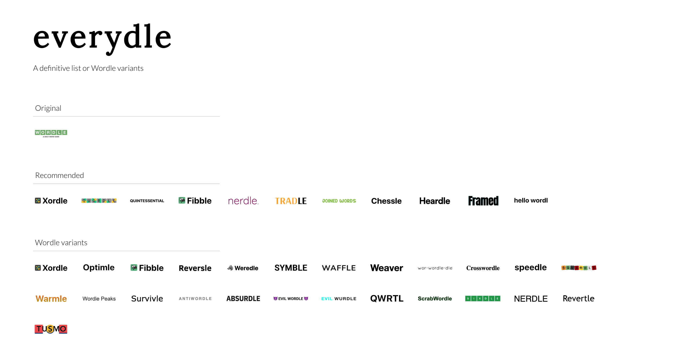

# everydle

A comprehensive list of Wordle variants.

https://everydle.unruffled-nightingale.com/

-------

-------

## Available Scripts

In the project directory, you can run:

### `yarn install`

Installs app dependencies.

### `yarn start`

Runs the app in the development mode.\
Open [http://localhost:3000](http://localhost:3000) to view it in the browser.

The page will reload if you make edits.
You will also see any lint errors in the console.

### `yarn build`

Builds the app for production to the `build` folder.\
It correctly bundles React in production mode and optimizes the build for the best performance.

The build is minified and the filenames include the hashes.\
Your app is ready to be deployed!

See the section about [deployment](https://facebook.github.io/create-react-app/docs/deployment) for more information.

### `yarn docker:build`

Builds docker image of the production app with the name `everydle`.

### `yarn docker:run`

Builds and runs the production app in background mode. 

Open [http://localhost:3002](http://localhost:3002) to view it in the browser.

### `yarn docker:push`

Builds and publishes the production app to the docker registry defined by the environment variable `DOCKER_REGISTRY`
or defined in an `.env` file in the root project directory.

You must be already be logged into your docker registry for this command to work. 

### `yarn kube:apply`

Applies the kubenertes [deployment.yaml](./kube/deployment.yaml) to your kubernetes cluster.

You must must have `kubectl` configured for this command to work.

### `yarn kube:redeploy`

Redeploys the application on kubernetes.

You must must have `kubectl` configured for this command to work.

## TODOs

- Add genre tags to data to avoid duplication
- Move typs to their own file
- Add recent visited
